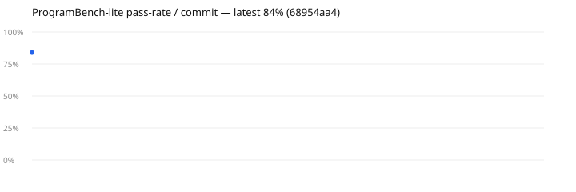

# program-bench

Per-commit **ProgramBench-lite** harness (CHOICES.md gate G-0006.b proxy).

ProgramBench proper is a cleanroom binary-reconstruction benchmark that scores
~0% on every frontier model — no local corpus, no per-commit signal. This is the
LITE proxy: a handful of small CLI programs the agent reconstructs from a
behavioural usage doc (`spec.md`), graded against HIDDEN behavioural test cases
(`cases.jsonl`).

**MiniMax-only.** The solver runs on the MiniMax subscription exclusively; the
harness refuses any `claude`/Anthropic alias (claude is reserved for dev). See
the guard in `run.ts`.

```
program-bench/
├── run.ts            # solve → score → append results.jsonl → render trend.svg → (gated) feedback
├── run.test.ts       # deterministic scorer self-check (no LLM)
├── corpus/<id>/      # spec.md (shown to solver) + cases.jsonl (hidden tests)
├── results.jsonl     # one row per commit run
├── trend.svg         # pass-rate / commit (embedded below + served by webui)
└── cron.sh           # 10-min queue poller — NOT installed; see "Scaling" below
```

## Run

```bash
bun program-bench/run.ts                 # score HEAD, persist, render
bun program-bench/run.ts --dry           # stub solver, no LLM (used by the self-check)
bun program-bench/run.ts --feedback      # also write a feedback row to the ingest pipeline
bun program-bench/run.ts --tasks rot13   # subset
bun test program-bench/run.test.ts       # self-check
```

## Trend



## Metrics (G-0006.b)

`pass_rate`, `secs_per_task` (cost proxy — true $/task needs a metered runtime we
don't have), `slices_per_task=1` (single-agent solver), `hitl=0`.

## Scaling (gated — prove before scaling)

The one-commit proof is done: the metric is live and discriminating (not pinned
at 0/100%). Only after it demonstrably MOVES across ≥2 commits, enable:

1. **10-min cron** — `cron.sh` polls for a new HEAD and runs the bench. Install
   via the project's scheduler (see `systemd/`), not from here.
2. **Feedback writeback** — `--feedback` writes one `feedback` ledger row per run
   naming the sub-100% tasks as improvement targets; `feedback-aggregate.ts`
   turns those into a Proposal. Active for results dated ≥ 2026-06-22.
